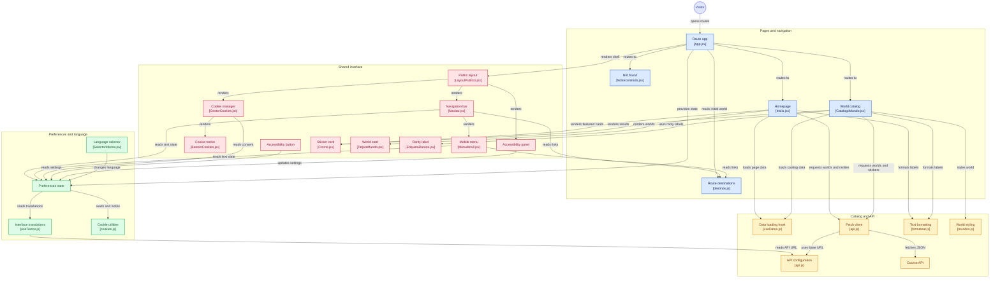

```mermaid
%% Generated by https://gitdiagram.com/juan122421/cromoverso
flowchart TD

subgraph group_navigation["Pages and navigation"]
  node_app["Route app<br/>[App.jsx]"]
  node_home["Homepage<br/>[Inicio.jsx]"]
  node_catalog["World catalog<br/>[CatalogoMundo.jsx]"]
  node_notfound["Not found<br/>[NoEncontrado.jsx]"]
  node_destinations["Route destinations<br/>[destinos.js]"]
end

subgraph group_data["Catalog and API"]
  node_data_hook["Data loading hook<br/>[useDatos.js]"]
  node_api_client["Fetch client<br/>[api.js]"]
  node_api_config["API configuration<br/>[api.js]"]
  node_course_api["Course API"]
  node_formatting["Text formatting<br/>[formatear.js]"]
  node_world_config["World styling<br/>[mundos.js]"]
end

subgraph group_preferences["Preferences and language"]
  node_language_selector["Language selector<br/>[SelectorIdioma.jsx]"]
  node_preferences["Preferences state"]
  node_text_loader["Interface translations<br/>[useTextos.js]"]
  node_cookie_utils["Cookie utilities<br/>[cookies.js]"]
end

subgraph group_shell["Shared interface"]
  node_layout["Public layout<br/>[LayoutPublico.jsx]"]
  node_navbar["Navigation bar<br/>[Navbar.jsx]"]
  node_mobilemenu["Mobile menu<br/>[MenuMovil.jsx]"]
  node_cookie_manager["Cookie manager<br/>[GestorCookies.jsx]"]
  node_cookie_banner["Cookie notice<br/>[BannerCookies.jsx]"]
  node_access_panel["Accessibility panel"]
  node_access_button["Accessibility button"]
  node_sticker["Sticker card<br/>[Cromo.jsx]"]
  node_world_card["World card<br/>[TarjetaMundo.jsx]"]
  node_rarity_label["Rarity label<br/>[EtiquetaRareza.jsx]"]
end

node_visitor(("Visitor"))

node_visitor -->|"opens routes"| node_app
node_app -->|"provides state"| node_preferences
node_app -->|"renders shell"| node_layout
node_app -->|"routes to"| node_home
node_app -->|"routes to"| node_catalog
node_app -->|"routes to"| node_notfound
node_app -->|"reads initial world"| node_destinations
node_layout -->|"renders"| node_navbar
node_layout -->|"renders"| node_cookie_manager
node_layout -->|"renders"| node_access_panel
node_navbar -->|"renders"| node_mobilemenu
node_navbar -->|"reads text state"| node_preferences
node_navbar -->|"reads links"| node_destinations
node_mobilemenu -->|"reads text state"| node_preferences
node_mobilemenu -->|"reads links"| node_destinations
node_cookie_manager -->|"renders"| node_cookie_banner
node_cookie_manager -->|"reads consent"| node_preferences
node_access_button -->|"reads settings"| node_preferences
node_access_panel -->|"updates settings"| node_preferences
node_language_selector -->|"changes language"| node_preferences
node_preferences -->|"loads translations"| node_text_loader
node_preferences -->|"reads and writes"| node_cookie_utils
node_text_loader -->|"reads API URL"| node_api_config
node_home -->|"loads page data"| node_data_hook
node_catalog -->|"loads catalog data"| node_data_hook
node_home -->|"requests worlds and rarities"| node_api_client
node_catalog -->|"requests worlds and stickers"| node_api_client
node_api_client -->|"uses base URL"| node_api_config
node_api_client -->|"fetches JSON"| node_course_api
node_home -->|"renders featured cards"| node_sticker
node_home -->|"renders worlds"| node_world_card
node_catalog -->|"renders results"| node_sticker
node_catalog -->|"uses rarity labels"| node_rarity_label
node_home -->|"formats labels"| node_formatting
node_catalog -->|"formats labels"| node_formatting
node_catalog -->|"styles world"| node_world_config

click node_app "https://github.com/juan122421/cromoverso/blob/main/src/App.jsx"
click node_home "https://github.com/juan122421/cromoverso/blob/main/src/pages/Inicio.jsx"
click node_catalog "https://github.com/juan122421/cromoverso/blob/main/src/pages/CatalogoMundo.jsx"
click node_notfound "https://github.com/juan122421/cromoverso/blob/main/src/pages/NoEncontrado.jsx"
click node_layout "https://github.com/juan122421/cromoverso/blob/main/src/components/LayoutPublico/LayoutPublico.jsx"
click node_navbar "https://github.com/juan122421/cromoverso/blob/main/src/components/Navbar/Navbar.jsx"
click node_mobilemenu "https://github.com/juan122421/cromoverso/blob/main/src/components/MenuMovil/MenuMovil.jsx"
click node_cookie_manager "https://github.com/juan122421/cromoverso/blob/main/src/components/GestorCookies/GestorCookies.jsx"
click node_cookie_banner "https://github.com/juan122421/cromoverso/blob/main/src/components/BannerCookies/BannerCookies.jsx"
click node_access_panel "https://github.com/juan122421/cromoverso/blob/main/src/components/PanelAccesibilidad/PanelAccesibilidad.jsx"
click node_access_button "https://github.com/juan122421/cromoverso/blob/main/src/components/BotonAccesibilidad/BotonAccesibilidad.jsx"
click node_language_selector "https://github.com/juan122421/cromoverso/blob/main/src/components/SelectorIdioma/SelectorIdioma.jsx"
click node_preferences "https://github.com/juan122421/cromoverso/blob/main/src/context/PreferenciasContext.jsx"
click node_text_loader "https://github.com/juan122421/cromoverso/blob/main/src/hooks/useTextos.js"
click node_cookie_utils "https://github.com/juan122421/cromoverso/blob/main/src/utils/cookies.js"
click node_data_hook "https://github.com/juan122421/cromoverso/blob/main/src/hooks/useDatos.js"
click node_api_client "https://github.com/juan122421/cromoverso/blob/main/src/services/api.js"
click node_api_config "https://github.com/juan122421/cromoverso/blob/main/src/config/api.js"
click node_sticker "https://github.com/juan122421/cromoverso/blob/main/src/components/Cromo/Cromo.jsx"
click node_world_card "https://github.com/juan122421/cromoverso/blob/main/src/components/TarjetaMundo/TarjetaMundo.jsx"
click node_rarity_label "https://github.com/juan122421/cromoverso/blob/main/src/components/EtiquetaRareza/EtiquetaRareza.jsx"
click node_formatting "https://github.com/juan122421/cromoverso/blob/main/src/utils/formatear.js"
click node_destinations "https://github.com/juan122421/cromoverso/blob/main/src/config/destinos.js"
click node_world_config "https://github.com/juan122421/cromoverso/blob/main/src/config/mundos.js"

classDef toneNeutral fill:#f8fafc,stroke:#334155,stroke-width:1.5px,color:#0f172a
classDef toneBlue fill:#dbeafe,stroke:#2563eb,stroke-width:1.5px,color:#172554
classDef toneAmber fill:#fef3c7,stroke:#d97706,stroke-width:1.5px,color:#78350f
classDef toneMint fill:#dcfce7,stroke:#16a34a,stroke-width:1.5px,color:#14532d
classDef toneRose fill:#ffe4e6,stroke:#e11d48,stroke-width:1.5px,color:#881337
classDef toneIndigo fill:#e0e7ff,stroke:#4f46e5,stroke-width:1.5px,color:#312e81
classDef toneTeal fill:#ccfbf1,stroke:#0f766e,stroke-width:1.5px,color:#134e4a
class node_app,node_home,node_catalog,node_notfound,node_destinations toneBlue
class node_data_hook,node_api_client,node_api_config,node_course_api,node_formatting,node_world_config toneAmber
class node_language_selector,node_preferences,node_text_loader,node_cookie_utils toneMint
class node_layout,node_navbar,node_mobilemenu,node_cookie_manager,node_cookie_banner,node_access_panel,node_access_button,node_sticker,node_world_card,node_rarity_label toneRose
class node_visitor toneIndigo
```